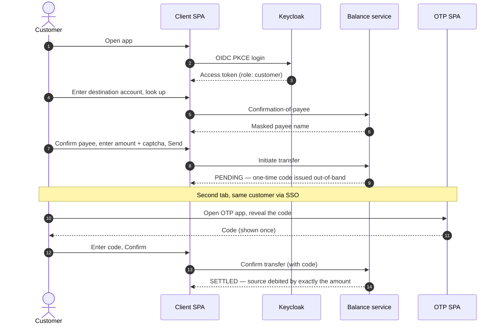
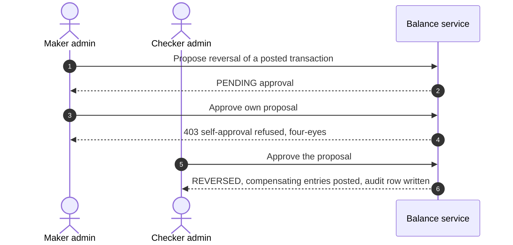

# SuperCool Finances

A safety-critical demo service for managing customer account balances: customer money is
never created, lost, or moved without authorization. A public customer surface and a
private admin surface sit behind gateways, over an authoritative transactional core plus a
derived analytics read model, all orchestrated with Docker Compose.

- **What it is / why:** [`docs/`](docs/) — architecture, decisions (ADRs), threat model.
- **What to build, in order:** [`specs/`](specs/) (start at [`specs/README.md`](specs/README.md)).
- **How we build it (the working agreement):** [`CLAUDE.md`](CLAUDE.md).
- **How it was actually built:** [`conversation-exports/`](conversation-exports/) — the working
  transcripts, one per workstream.

See [Learn more](#learn-more--architecture-flows--how-it-was-built) for the full map.

---

## Run the demo

A clean `docker compose up` brings up the **whole system** — both planes:

- **Customer plane** — `http://localhost:8080`: the customer SPA + the out-of-band OTP
  SPA, proving a full **transfer-with-OTP** from the browser.
- **Admin plane** — `http://localhost:8081`: the admin SPA (the internal front door), for
  the **maker-checker reversal**, account freeze/unfreeze, limits, the audit trail, and the
  analytics dashboard.

Both sit over the identity provider, the two gateways, the balance service, and the
analytics read model. The logins and seeded accounts for each are listed in
[step 4](#seeded-logins--accounts).

> ⚠️ **Use two separate browsers** (or one normal window + one private/incognito window)
> whenever you need **two different users signed in at once** — a **customer** on `:8080`
> **and** an **admin** on `:8081`, or the **two admins** for the maker-checker reversal.
> Every app shares **one Keycloak SSO session per browser**, so a second login in the same
> browser silently replaces the first and the sessions get mixed. Revealing the OTP as the
> **same** customer in a second **tab** is fine (same user, same session).

### Prerequisites

- **Docker Desktop** (Compose v2) running.
- **`*.localtest.me` must resolve to `127.0.0.1`.** The browser reaches the apps at
  `http://localhost:8080` and **Keycloak at `http://keycloak.localtest.me:8082`** — the
  OIDC issuer host must be byte-identical for the browser and for in-container services,
  which is why it is a hostname, not `localhost`. Public DNS already maps `*.localtest.me`
  to `127.0.0.1`; if your host has no such DNS (offline / split-horizon), add this line to
  your hosts file (`/etc/hosts`, or `C:\Windows\System32\drivers\etc\hosts`):

  ```
  127.0.0.1 keycloak.localtest.me
  ```

- **Node ≥ 24** — only if you want to run the end-to-end test (below).

### 1. Configure

```bash
cp .env.example .env
```

`.env` is git-ignored; `.env.example` ships **safe placeholder** values (local demo
passwords only — never real secrets). That copy is the **only** manual step.

### 2. Bring the stack up (wait for all-healthy)

```bash
docker compose up --build          # or: docker compose up -d --build --wait
```

On a clean machine the first run pulls base images and builds four app images (two NestJS
services + two Vite SPAs), so it takes several minutes. It is up when every service is
**healthy**: datastores → Keycloak (realm imported) → balance-service (migrations run on
boot) → public-Kong → the SPAs → public-nginx.

Host-published surfaces: **`:8080`** (public-nginx — the customer front door),
**`:8081`** (internal-nginx — the admin front door), and **`:8082`** (Keycloak, for the
login redirect). Nothing else is published.

### 3. Load the demo data (idempotent seed)

```bash
docker compose --profile seed run --rm seed   # one-shot: runs the seed and returns when it exits
```

> Use `run --rm seed`, **not** `--profile seed up`. `up` attaches to the logs of the
> whole dependency graph (the long-running `balance-service`, `postgres`, …), so it keeps
> streaming after the seed container has finished and never returns to the prompt. `run`
> attaches to **only** the seed container and returns with its exit code; `--rm` removes
> that one-shot container afterward. (The stack from step 2 is already up, so this just
> runs the seed against it.)

This loads the demo customers + their MXN accounts into the balance DB (system constants —
currency, clearing accounts, baseline limits — are already seeded by boot migrations, not
by this step). It is **idempotent**: re-running it changes nothing.

- **Customer A** — the login: account `1000000001`, funded **1,000,000.00 MXN**.
- **Customer B** — the transfer destination (no login): account `1000000002`.

### 4. Log in and move money

The headline flow — an **internal transfer authorized by an out-of-band one-time code**.
The code is revealed in a **separate** OTP app, never in the page that starts the transfer,
so a stolen session alone cannot move money:



Step by step:

1. Open **http://localhost:8080** and log in as the seeded customer:

   | Username | Password |
   |---|---|
   | `demo-customer` | `demo-customer-pw` |

   *(Demo credentials from the committed `tools/keycloak/realm-export.json` — local demo
   only.)* You land on **Your accounts** and see account `1000000001`.

2. **Send money → confirmation-of-payee.** Choose *Send money*, enter destination
   `1000000002`, look it up, and confirm the masked payee.
3. **Amount + captcha.** Enter an amount (e.g. `10.00`), solve the demo captcha, *Send*.
   The transfer is now **pending**, awaiting the out-of-band code.
4. **Reveal the OTP out-of-band.** In a **second tab**, open **http://localhost:8080/otp/**,
   log in as the same `demo-customer`, and *reveal* the one-time code for the pending
   authorization (shown once).
5. **Confirm.** Back in the first tab, enter the code and *Confirm transfer*. The transfer
   settles and the source balance drops by exactly the amount.

#### Seeded logins & accounts

A clean `docker compose up` + the seed load **11 customers / 17 MXN accounts** plus
**2 admins**. Every login below comes from the committed
`tools/keycloak/realm-export.json` (local demo only — `temporary: false`); full
per-customer detail (ids, sub alignment) lives in
[`tools/seed/docs/README.md`](tools/seed/docs/README.md).

**Customers** — realm role `customer`, log in at **http://localhost:8080**:

| Username | Password | Primary account | Balance (MXN) | Extra accounts (MXN) |
|---|---|---|---|---|
| `demo-customer` | `demo-customer-pw` | `1000000001` | 1,000,000.00 | — |
| `demo-customer-2` | `demo-customer-2-pw` | `1000000003` | 200,000.00 | `1000000012` (50,000.00), `1000000013` (25,000.00) |
| `demo-customer-3` | `demo-customer-3-pw` | `1000000004` | 300,000.00 | `1000000014` (50,000.00) |
| `demo-customer-4` | `demo-customer-4-pw` | `1000000005` | 400,000.00 | `1000000015` (50,000.00), `1000000016` (25,000.00) |
| `demo-customer-5` | `demo-customer-5-pw` | `1000000006` | 500,000.00 | `1000000017` (50,000.00) |
| `demo-customer-6` | `demo-customer-6-pw` | `1000000007` | 600,000.00 | — |
| `demo-customer-7` | `demo-customer-7-pw` | `1000000008` | 700,000.00 | — |
| `demo-customer-8` | `demo-customer-8-pw` | `1000000009` | 800,000.00 | — |
| `demo-customer-9` | `demo-customer-9-pw` | `1000000010` | 900,000.00 | — |
| `demo-customer-10` | `demo-customer-10-pw` | `1000000011` | 1,000,000.00 | — |

**No-login payee** — no Keycloak user; exists only as a confirmation-of-payee target:
**Maria Gonzalez**, account `1000000002`, **500,000.00 MXN** (this is "Customer B" above).

**Admins** — realm role `admin`, log in at the **admin console http://localhost:8081**.
They own **no** customer accounts; they act on the admin surface (reversals, account
freeze/unfreeze, limits, audit, analytics):

| Username | Password | Demo role |
|---|---|---|
| `demo-admin` | `demo-admin-pw` | maker — proposes a reversal, freezes/unfreezes accounts, edits limits |
| `demo-admin-2` | `demo-admin-2-pw` | checker — the four-eyes approver (must differ from the maker) |

> The two admins exist so the **maker-checker reversal** can be demonstrated: four-eyes
> requires the approver to differ from the proposer, so one admin proposes and the other
> approves. Total seeded accounts = 11 primaries (`1000000001`–`1000000011`) + 6 extras
> (`1000000012`–`1000000017`) = **17**.

### 5. Tear down

```bash
docker compose down        # stop; keep data volumes
docker compose down -v      # stop and remove volumes (fresh next boot)
```

A clean, repeatable re-run is `down -v` → step 2 → step 3 (migrations no-op, seed no-op).

---

## What you can do

Two role-separated surfaces behind two front doors. Each login's role (from the realm) is
what the gateway enforces — a `customer` token cannot reach the admin surface and vice versa.

### Customer operations — the customer SPA (`:8080`, role `customer`)

- **See your accounts & balances** — the overview lists every account you own with its
  available balance.
- **Open a new account** — self-service, capped at **5** accounts per customer.
- **Confirmation-of-payee** — look up a destination account and confirm the **masked**
  holder name before sending.
- **Send an internal transfer** — authorized by an out-of-band **OTP** (the flow in
  step 4); the source is debited **exactly once** on confirm.
- **Review your transactions** — per-account history.

External (off-platform) payees exist in the domain but are **not** seeded, so that path
needs a payee enrolled by hand — see the [scope note](#scope-note).

### Admin operations — the admin SPA (`:8081`, role `admin`)

- **View any account, its limits, and its transactions** — read across all customers.
- **Freeze / unfreeze an account** — block or restore money movement.
- **Adjust limits** — per-customer per-transaction / daily / monthly caps.
- **Maker-checker reversal** — one admin *proposes* a reversal; a **different** admin
  *approves* it. Self-approval is refused (four-eyes). Only then is the transaction reversed.
- **Audit trail** — every admin mutation is recorded; browse the filterable log.
- **Analytics dashboard** — account summaries + daily aggregates from the read model.

The maker-checker reversal needs **two** admins — so use two browsers (see the note above):



---

## Automated end-to-end (the same flow, headless)

A one-command harness brings the stack up all-healthy, seeds, installs a browser, and runs
the client **transfer-with-OTP** Playwright e2e against the real chain (driving the real
otp-app in a second browser context) **plus the admin plane on `:8081`** — the whoami
landing, the read screens, and the **maker-checker reversal + audit** — then tears down:

```bash
bash tests/e2e-fullrun/run.sh          # full run; tears down at the end
bash tests/e2e-fullrun/run.sh keep     # leave the stack up for inspection
```

It uses an isolated compose project + an `--env-file` temp copy of `.env.example`, so it
never touches your `.env`. See [`tests/e2e-fullrun/README.md`](tests/e2e-fullrun/README.md)
for the seed↔e2e env contract and what each phase proves. Other acceptance harnesses live
alongside it under [`tests/`](tests/) (`macro`, `storage`, `keycloak`, `transport`,
`build-serve`, `seed`).

---

## Learn more — architecture, flows & how it was built

| Where | What's there |
|---|---|
| [`docs/`](docs/) | Cross-cutting design: [`ARCHITECTURE.md`](docs/ARCHITECTURE.md) (the moving parts + how they fit), the ADR log [`DECISIONS.md`](docs/DECISIONS.md) (why each choice was made), and the [`THREAT-MODEL.md`](docs/THREAT-MODEL.md). |
| [`specs/`](specs/) | The build specs, **in order** — start at [`specs/README.md`](specs/README.md). Component specs [`00`](specs/00-architecture.md)–[`08`](specs/08-build-and-serve.md), the [`DATA-MODEL.md`](specs/DATA-MODEL.md), and the `balance`/`analytics` schemas. Each spec ends with a **Definition of Done**. |
| [`conversation-exports/`](conversation-exports/) | **How it was actually built** — the working transcripts, one per workstream: [`data-modeling`](conversation-exports/data-modeling.txt), [`balance-service`](conversation-exports/balance-service.txt), [`analytics-server`](conversation-exports/analytics-server.txt), [`transport-layer`](conversation-exports/transport-layer.txt), [`client-otp.frontend`](conversation-exports/client-otp.frontend.txt), [`admin-web-app`](conversation-exports/admin-web-app.txt), [`pipeline-serve`](conversation-exports/pipeline-serve.txt). Each component designed and built, decision by decision. |
| [`CLAUDE.md`](CLAUDE.md) | The working agreement: top-down methodology, the implementor → test-writer → self-reviewer workflow, and the repo conventions every change follows. |
| Per-component `docs/` | Each service and SPA documents its own internals, e.g. [`services/balance-service/docs/`](services/balance-service/docs/), [`services/analytics-server/docs/`](services/analytics-server/docs/), [`web/client/docs/`](web/client/docs/), [`web/admin/docs/`](web/admin/docs/). |

---

## Scope note

A clean `docker compose up` brings up **both planes** — the public edge (`public-nginx` /
`:8080`, the client + otp SPAs) **and** the internal edge (`internal-nginx` / `:8081`,
`internal-kong`, the admin SPA) — so the customer **transfer-with-OTP** and the admin
**maker-checker reversal** both run end to end on one machine.

What the **seed** does _not_ create: external (off-platform) payees. The demo dataset is
the customers + their internal MXN accounts only, so the **external-rail outbound** flow
needs a payee enrolled by hand; the automated e2e therefore exercises the internal
transfer-with-OTP (the identical out-of-band OTP chain). See
[`specs/08-build-and-serve.md`](specs/08-build-and-serve.md) §"Full run" and
[`tests/e2e-fullrun/README.md`](tests/e2e-fullrun/README.md).
