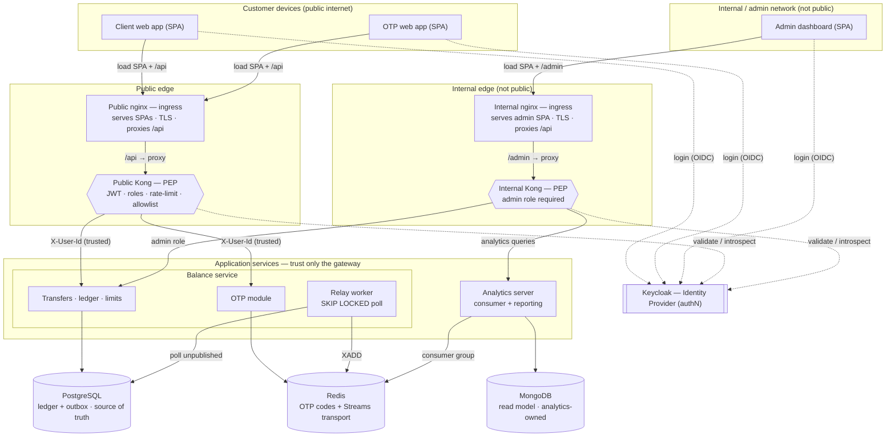
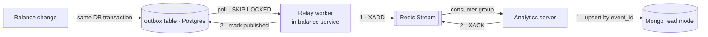

# SuperCool Finances — Balance Service Architecture

> A safety-critical service for managing customer account balances. The design's
> primary obligation is that **customer money is never created, lost, or moved
> without authorization**. Everything else (frameworks, gateways, UIs) is in
> service of that.

- **Companion docs:** [DECISIONS.md](./DECISIONS.md) (full decision log with
  alternatives) · [THREAT-MODEL.md](./THREAT-MODEL.md) (STRIDE-lite threats →
  mitigations)
- **Status:** design baseline for the technical test.

---

## 1. Guiding principles

These are the rules every component below is measured against.

1. **The ledger is the source of truth.** Balances are *derived* from an
   immutable, append-only, double-entry ledger in an ACID store (Postgres) — not
   a mutable `balance` column that gets `UPDATE`d.
2. **Defense in depth.** The customer plane and the admin plane are physically
   separated. Authentication happens at the edge; authorization happens at
   *both* the edge (coarse) and the service (object-level).
3. **Secure by default.** Ownership and idempotency checks live in shared
   guards / scoped repositories, so a new endpoint can't silently *forget* them.
4. **Atomicity over dual-writes.** A money change and its emitted event commit in
   the *same* database transaction (transactional outbox). No "write DB, then
   publish" step that can half-fail.
5. **Mock honestly, document the production path.** Where a real dependency would
   add friction for the evaluator (external banking rails, OTP delivery), we mock
   it *behind a clean seam* and state what production would use.

---

## 2. System topology

Two independent edges, one per plane. Each edge is an **nginx ingress** that
serves the plane's web app(s) and terminates TLS, sitting in front of a **Kong**
gateway that enforces API policy. The **public** edge serves the client and OTP
web apps and faces customer traffic; the **internal** edge serves the admin
dashboard and is not reachable from the public internet. Both Kongs delegate
authentication to Keycloak. Application services trust **only** the
gateway-injected identity.



### The request path & trust boundary

1. The browser loads the SPA from the plane's **nginx ingress** — public nginx
   for the client/OTP apps, internal nginx for the admin dashboard. nginx
   terminates TLS, serves the static bundle, and reverse-proxies the plane's API
   prefix (`/api` on the public plane, `/admin` on the internal plane) to that
   plane's Kong. The bundle is public; nothing sensitive is gated by "who can
   load the SPA."
2. The user authenticates against **Keycloak** and receives a signed JWT.
   Keycloak is the only component that authenticates a human.
3. Every API request reaches **Kong** (the Policy Enforcement Point) via nginx,
   and Kong:
   - validates the JWT signature against Keycloak's JWKS and checks expiry;
   - optionally **introspects** (RFC 7662) to catch revoked tokens ("still
     valid?");
   - checks the token's **role/scope against the route group** (customer routes
     need a customer token; the internal gateway rejects anything without the
     admin role);
   - enforces the **route allowlist** — the gateway config *is* the exposed API
     surface;
   - **rate-limits**, then injects a trusted identity header (`X-User-Id` = the
     token `sub`) downstream.
4. Services sit behind the gateway on an internal network and **trust only the
   gateway-injected identity** — never a user id from the request body/query.
   This holds only because services are not directly reachable (network policy;
   gateway↔service link authenticated). Otherwise the identity header is
   spoofable — see [THREAT-MODEL.md](./THREAT-MODEL.md).

---

## 3. Authentication & authorization

Clear division of responsibility — nothing "shares" authentication:

| Concern | Owner | What it does |
|---|---|---|
| **Ingress / static** | nginx (per plane) | Serves the plane's SPA bundle(s), terminates TLS, reverse-proxies the plane's API prefix (`/api` or `/admin`) to Kong. |
| **Authentication** | Keycloak (IdP) | Logs in the human, MFA-at-login, issues the signed JWT, exposes JWKS + introspection. |
| **Coarse authorization** | Kong (PEP) | Validates the token, checks role/scope vs. route group, allowlists routes, rate-limits, injects identity. |
| **Object-level authorization** | Each service | "Does this user actually own *this* resource?" |

### Object-level authorization (anti-IDOR)

The gateway cannot answer ownership — it has no ownership data. So every
customer-plane resource access is authorized in the service using **the `sub`
from the validated token + the resource id**, verified against the DB:

- **Enforce ownership *in the query***, not as a separate pre-check:
  `WHERE id = :resourceId AND owner_id = :userId`; zero rows → deny. Atomic, and
  impossible to forget.
- **Return `404`, not `403`,** for resources the user doesn't own, to avoid
  leaking existence (enumeration).
- **Cover nested/derived resources.** A transfer check must verify the *source
  account being debited* is the user's — not just that the transfer id exists.
  `GET /accounts/{a}/transactions/{t}` verifies both `a` is theirs and `t`
  belongs to `a`.
- **Ownership is customer-plane only.** The admin plane legitimately acts across
  users, so admin authorization is **role-based**, not ownership-based — which is
  exactly why the admin plane needs maker-checker + audit (§6).
- **Centralize it.** A shared guard / owner-scoped repository makes the secure
  path the default path — a new endpoint *cannot* skip the check by omission.

### Endpoint surfaces & prefixes

Every service (balance and analytics) splits its routes by prefix, and the prefix
is the **exposure contract**, not just a naming convention — it decides which
gateway (if any) may route the path and which auth applies:

| Prefix | Surface | Exposed via | Auth |
|---|---|---|---|
| `/api/*` | Customer-facing | Public nginx → **public Kong** only | Customer token + object-level authz |
| `/admin/*` | Admin operations | Internal nginx → **internal Kong** only | Admin role + audit (+ maker-checker on money ops) |
| `/internal/*` | Service-to-service | **No gateway** — internal network only | Service identity (mTLS / signed service token), never a user JWT |

Rules that make the split real:

- Each Kong allowlist is **prefix-scoped and default-deny**: public Kong routes
  only `/api/*`, internal Kong routes only `/admin/*`. **Neither gateway ever
  routes `/internal/*`** — that is the entire point of the prefix.
- **Defense in depth:** services *also* reject `/internal/*` calls that didn't
  arrive over the trusted service channel — they don't lean on the gateway alone,
  because the boundary is network isolation and network config can drift.
- **Per service:** the **balance service** exposes all three — `/api` (customer:
  accounts, balances, transfers, payee enrollment, OTP confirm), `/admin`
  (account freeze, limits, reversals, trigger simulated external inbound),
  `/internal` (mocked external-rail callbacks, health). The **analytics server**
  exposes `/admin` (dashboard reporting) and `/internal` (health / service calls)
  — **no `/api`**, since customers never query it directly.

---

## 4. Transaction step-up (OTP / transaction signing)

Login proves *who you are*; a sensitive money movement additionally requires
proof *for that specific action*. That is transaction signing, and its value
comes from being **out-of-band** and **user-scoped** (a single active, single-use
code).

**Design choices:**

- **Where it lives:** OTP is a **bounded module inside the balance service**, not
  a standalone service — it's transaction signing, so generation (at initiate)
  and verification (at confirm) sit in the transfer state machine the balance
  service already owns. Kept as its own package + Redis key-space so it's cleanly
  extractable if step-up is ever reused elsewhere. See
  [ADR-11](./DECISIONS.md#adr-11--service-boundaries--data-ownership).
- A **separate OTP web app with its own login** acts as the *simulated
  out-of-band channel*. Requiring its own authentication is what makes it read
  as a real second factor rather than showing a code in the same session that
  then consumes it. (For the technical test this avoids forcing the evaluator to
  set up an authenticator app — a deliberate, documented mock.)
- The code is **user-scoped** — **at most one active code per user**, single-use
  (atomic `GETDEL`), TTL-bound — and is the user's out-of-band second factor, **not**
  bound to a transaction. It authorizes **exactly one** transfer (two confirms with
  the same code can't both succeed). Generation is **singleton-gated**: a user may
  generate a code without a pending transfer (harmless), but **not while one is
  active** — a second generation is rejected; the slot frees only on use or TTL expiry.
  The OTP app *reveals / delivers* the user's current code. Because the code proves
  *the user* (single-use, TTL, out-of-band), it can't be hoarded or replayed;
  preventing duplicate *transfers* is a separate control (fingerprint window +
  idempotency), not the OTP's job.
- **Storage: Redis** — ephemeral, TTL-based, single-use. OTPs are disposable, so
  Redis's non-durability is a feature here, not a risk.
  - `TTL` 2–5 min for auto-expiry (no cleanup job).
  - **Single-use via an atomic op** (`GETDEL` or a small Lua script) so two
    concurrent confirmations can't both succeed.
  - An **attempt counter** locks the code after N wrong tries.
- Default flow is **code-entry** (OTP app shows the code, user types it into the
  client app). A push-approve variant is possible but adds polling/state.

```mermaid
sequenceDiagram
    actor U as User
    participant C as Client app
    participant B as Balance service
    participant R as Redis (OTP)
    participant O as OTP app (out-of-band)

    U->>C: Initiate transfer ($500 → ACME)
    C->>B: POST /transfers (Idempotency-Key)
    B->>B: Create PENDING tx
    B->>R: SET code — TTL 3m, single-use, user-scoped (otp:sub)
    B-->>C: 202 Pending — OTP required
    U->>O: Log in (separate channel)
    O->>B: GET /pending-authorizations
    B-->>O: "Approve $500 → ACME" + code
    U->>C: Enter code
    C->>B: POST /transfers/{id}/confirm (code)
    B->>R: GETDEL code (atomic, single-use)
    B->>B: Verify code = user's active OTP; post ledger entries
    B-->>C: Transfer POSTED
```

---

## 5. Money core (domain summary)

The detailed accounting design is service-level, but the safety guarantees it
must provide are architectural and are listed here so the "money is safe" claim
is auditable.

- **Double-entry, append-only ledger** in Postgres (the source of truth). Every
  transaction produces balanced debits/credits that sum to zero. Each account
  carries a **materialized `balance`** updated in the same transaction as the
  ledger entry (the posting acts as a reducer; `balance_after` is stored per
  entry); the balance is always rebuildable from the ledger.
- **Money type:** integer **minor units** (or fixed `DECIMAL`) + explicit
  currency code. Never floats.
- **Idempotency:** every money-moving endpoint takes an `Idempotency-Key`; a
  retry returns the original result instead of moving money twice.
- **Concurrency / no double-spend:** `SELECT ... FOR UPDATE` on the affected
  account row(s) — which hold the materialized `balance` + limit counters — locked
  in canonical order (READ COMMITTED), backed by a concurrency test that fires N
  simultaneous transfers and asserts no money is created, lost, or overdrafted.
- **Transaction lifecycle:** `PENDING → POSTED → FAILED / REVERSED`. Reversals
  are **compensating entries**, never mutations/deletes.
- **Internal vs. external flows:** external money moves through an internal
  **clearing account per rail** (the prototype has two — outbound-rail and
  inbound-rail), so double-entry holds even for mocked external rails (outbound:
  debit customer, credit the outbound-rail clearing; inbound: debit the
  inbound-rail clearing, credit customer). Each clearing balance is the net in
  transit for that rail and reconciles against that rail's feed
  ([ADR-15](DECISIONS.md#adr-15--clearing-accounts-per-rail)).
- **Holds (reserve → settle):** external outbound reserves funds via a
  materialized `held` field + an append-only `Hold` reservation ledger
  (`available = balance − held`); settlement converts a hold into a posted
  double-entry movement, failure/expiry releases it. `Hold` rows carry an external
  reference for later settlement/reconciliation against the rail
  ([ADR-14](DECISIONS.md#adr-14--holds--settlement)).
- **Limits:** configurable per-transaction, daily/monthly caps, and **velocity**
  checks. New external payees have a **cooling-off period** before they can
  receive money.
- **Reconciliation job:** periodically asserts `sum(ledger) == balances` and that
  internal accounts net to zero.

---

## 6. Admin plane & controls

- **Network isolation:** the admin plane sits behind the internal gateway on a
  non-public network.
- **Role-based authorization** at the internal gateway; admin acts across users.
- **Maker-checker (four-eyes):** no admin can unilaterally reverse/adjust a
  balance — a second admin approves. This shapes the admin service and the audit
  trail, so it's an architectural decision, not a UI detail.
- **Immutable audit log:** who did what, when — every admin action especially.

---

## 7. Event & analytics pipeline (CQRS read model)

Transactions are captured into a separate read model (MongoDB) for admin
analytics — **without** a dual-write. Postgres is the source of truth; Redis is
only the transport pipe.



**Why each edge is ordered the way it is:**

- The event row is written **in the same transaction** as the ledger change —
  money moved ⇔ event recorded, all-or-nothing. This is the whole point of the
  outbox; it kills the divergence a `DB + publish` dual-write would cause.
- The relay is a **background worker inside the balance service** (a
  short-interval poller, not an OS cron — cron's 1-min floor is too slow) that
  claims outbox rows with `SELECT ... FOR UPDATE SKIP LOCKED`, so multiple
  balance-service instances never double-publish. It **`XADD`s first, then marks
  the row published** — a crash in between just re-publishes. Result:
  **at-least-once** delivery, never lost.
- The consumer **writes to Mongo, then `XACK`s** — an unacked message is
  redelivered rather than lost.
- At-least-once ⇒ duplicates are possible ⇒ the consumer is **idempotent**
  (upsert on a unique `event_id`). Stuck messages (consumer grabbed then died)
  are recovered with `XPENDING` + `XCLAIM`.
- **Redis Streams, not Pub/Sub** — Streams persist, support consumer groups and
  acks, and can replay; Pub/Sub is fire-and-forget and would drop transactions.

> Reusing the single Redis for both OTP and the stream is a deliberate demo
> simplification (fewer moving parts). In production the event backbone would
> likely be Kafka/RabbitMQ, while OTP stays on Redis.

---

## 8. Cross-cutting concerns

- **Rate limiting** at both gateways, tighter on auth and money endpoints.
- **Time & timezone:** the backend is **UTC-only** — every service stores and serves
  UTC (`timestamptz` instants, ISO-8601 `Z`). Localizing to **Mexico City time
  (`America/Mexico_City`)** is exclusively a client-app presentation concern; no
  service formats or assumes a local zone.
- **Bot/abuse protection:** a **library-based captcha** on the client (a demo
  stub — rate limiting is the real control; a hosted captcha is the production
  path).
- **Observability:** structured logs, a correlation/request id threaded across
  services, health checks, basic metrics.
- **Secrets & config:** env/Docker secrets for the demo; a real secret manager
  (e.g. Vault) noted as the production path.
- **Schema migrations** versioned and run on startup.
- **One-command run:** `docker-compose up` brings up the full topology with seed
  data.

---

## 9. What's real vs. mocked

Honesty about scope is part of the deliverable.

| Area | In this build | Production path |
|---|---|---|
| Ledger, balances, transfers | **Real** (Postgres, double-entry) | same |
| Idempotency & concurrency safety | **Real** + tests | same |
| Outbox → Streams → Mongo | **Real** | Kafka/RabbitMQ backbone |
| AuthN / gateways | **Real** (Keycloak + 2× Kong) | same + mTLS gateway↔service |
| OTP transaction signing | **Real** logic, **mocked** delivery (OTP app) | out-of-band push/SMS/TOTP |
| External banking rails | **Mocked** inbound + outbound via clearing account | real rails/PSP |
| Captcha | **Library stub** | hosted captcha / WAF |

---

## 10. Deliverables checklist

- [ ] Two-gateway topology running; admin plane genuinely isolated
- [ ] Edge authN + coarse authZ (Kong) + object-level authZ (service) + trust boundary
- [ ] One customer flow end-to-end (internal transfer + mocked external outbound with OTP)
- [ ] One admin flow (limit change or reversal) with maker-checker + audit
- [ ] Rate limiting + allowlist routing demonstrable
- [ ] `docker-compose up` with seed data
- [ ] Tests: idempotency retry, concurrency (no double-spend), reconciliation
- [ ] This doc set: ARCHITECTURE + DECISIONS + THREAT-MODEL
