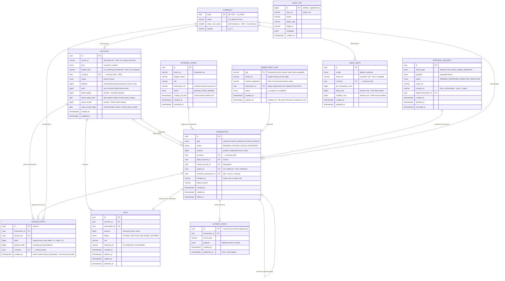
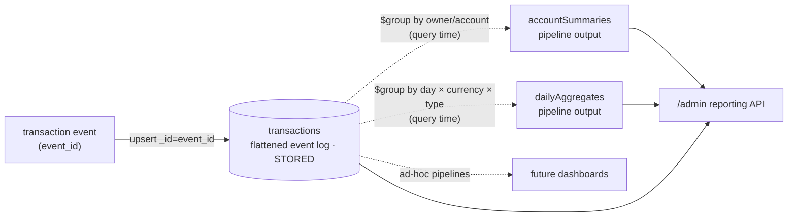

# Data Model — Balance Service (Postgres) & Analytics Server (Mongo)

Companion design doc for [`04-balance-service.md`](./04-balance-service.md) and
[`05-analytics-server.md`](./05-analytics-server.md). It fixes the **entity shapes**
before any migration or collection is written, so the micro (columns, indexes,
invariants) falls out of the macro already locked in the specs and
[`../docs/DECISIONS.md`](../docs/DECISIONS.md).

Two stores, two ownerships (database-per-service, [ADR-11](../docs/DECISIONS.md#adr-11--service-boundaries--data-ownership)):

1. **Postgres `balance`** — authoritative transactional core (this section, below).
2. **Mongo `analytics`** — derived read model (⏳ *defined next, after the entity
   design is signed off*).

---

## Part 1 — Postgres entities (balance service, source of truth)

### Boundary notes (read first)

- **There is no `Customer` table.** Customers are identities in **Keycloak**; the
  balance DB references a customer only by their Keycloak `sub` as an opaque
  `owner_id` (string). No FK crosses into another service's store
  ([ADR-11](../docs/DECISIONS.md#adr-11--service-boundaries--data-ownership)). Seed
  data ([`tools/seed`](../tools/)) provisions customers in Keycloak and their
  accounts/limits here, keyed by that `sub`.
- **Money is `bigint` minor units + a `currency` code — never float**
  ([ADR-4](../docs/DECISIONS.md#adr-4--postgres-double-entry-ledger-as-the-source-of-truth)).
  Currency is **normalized** in a `currency` reference table (`code`, `name`,
  `minor_unit_scale`, `symbol`); every money-bearing row **FKs to `currency.code`**.
  The prototype seeds **MXN** only — adding a currency is a **data insert** into
  `currency`, not a schema change.
- **The ledger is the source of truth; `balance` and `held` are transactionally-synced
  projections** ([ADR-13](../docs/DECISIONS.md#adr-13--concurrency--balance-projection),
  [ADR-14](../docs/DECISIONS.md#adr-14--holds--settlement)). Both are always rebuildable
  from `ledger_entry` / `hold`.
- **Conventions from the scaffold:** `snake_case` columns set explicitly (no global
  naming strategy), `timestamptz` for time, `synchronize:false` — schema only via
  migrations run on boot. **All `timestamptz` values are UTC instants** — the server
  never localizes; client apps convert to Mexico City time for display (cross-cutting
  rule 5).

### Entity–relationship diagram



### Enumerations

| Enum | Values | Notes |
|---|---|---|
| `account_kind` | `customer`, `system` | System = per-rail clearing accounts ([ADR-15](../docs/DECISIONS.md#adr-15--clearing-accounts-per-rail)). |
| `account_status` | `active`, `frozen` | Frozen blocks debits/credits; set via `/admin` freeze. |
| `transaction_type` | `internal`, `external_outbound`, `external_inbound` | Drives which accounts are debit/credit legs. |
| `transaction_status` | `PENDING`, `POSTED`, `FAILED`, `REVERSED` | Lifecycle (spec 04). Reversal is a new compensating tx, not a mutation. |
| `hold_status` | `PLACED`, `SETTLED`, `RELEASED`, `EXPIRED` | Only `PLACED` counts toward `account.held`. |
| `payee_status` | `pending`, `active`, `disabled` | Not usable as a destination unless `active` **and** past cooling-off. |
| `user_limits_scope` | `global`, `customer` | Customer scope overrides global. |
| `approval_action` | `reversal`, `user_limits_change`, `adjustment` | Maker-checker gated admin ops ([ADR-8](../docs/DECISIONS.md#adr-8--maker-checker-for-admin-money-operations)). |
| `approval_status` | `PENDING`, `APPROVED`, `REJECTED`, `EXECUTED` | Only `APPROVED` → `EXECUTED`. |
| `idempotency_status` | `in_progress`, `completed` | `in_progress` guards a concurrent retry mid-flight. |

### Per-entity invariants & key indexes

**`currency`** — reference/lookup table for ISO currencies.
- `code` PK (ISO 4217, e.g. `MXN`); `minor_unit_scale` gives the decimal places
  (MXN = 2 → centavos) so a `bigint` minor-units amount is interpretable per currency.
  Seeded with MXN; a new currency is an **insert**, not a migration. Every money-bearing
  row FKs to `currency.code`.

**`account`** — the row every money op locks (`SELECT ... FOR UPDATE`, [ADR-13](../docs/DECISIONS.md#adr-13--concurrency--balance-projection)).
- `available = balance − held` (derived, **never stored**).
- `held >= 0`; customer-account debits require `available >= amount` (overdraft
  invariant). Clearing accounts may go negative (net in transit) — **no** blanket
  `balance >= 0` check.
- **Fixed-window** spend counters (calendar day / calendar month, **not** rolling):
  `spent_today` resets when `spent_today_date <> today`, and `spent_month` resets when
  `spent_month_date`'s month rolls — lazily, under the row lock. The date fields are
  the window markers.
- Indexes: `idx_account_owner (owner_id) WHERE kind = 'customer'`; unique
  `uq_account_system_key (system_key) WHERE kind = 'system'`.

**`ledger_entry`** — append-only, the source of truth ([ADR-4](../docs/DECISIONS.md#adr-4--postgres-double-entry-ledger-as-the-source-of-truth)).
- Per `transaction_id`: `SUM(delta) = 0` (double-entry).
- `balance_after = (prev balance_after for account_id, by `created_at`) + delta` —
  the running fold; matches `account.balance` after the tx.
- **Posting is an atomic reducer, balance-then-ledger:** under the account
  `FOR UPDATE` lock, **update `balance` first** (`balance := balance + delta`), **then
  insert** this entry with `balance_after` = the new balance. Both commit in one
  transaction ([ADR-13](../docs/DECISIONS.md#adr-13--concurrency--balance-projection)).
- **No UPDATE/DELETE** — enforced by convention + a revoke in the app role; a
  reversal appends new entries.
- **PK is `uuid` (v4);** ordering for statements/reconstruction uses `created_at`
  captured at **insert** (`clock_timestamp()`, not transaction start), which is
  **per-account monotonic** because posting holds the account `FOR UPDATE` (its
  entries are serialized). Index `idx_ledger_account_created (account_id, created_at)`.

**`transaction`** — the header grouping the ledger legs.
- Header FKs (`debit_account_id`/`credit_account_id`) are a **query/authz
  convenience**; the ledger entries remain authoritative. Object-level authz checks
  the *account being debited* is the caller's ([ADR-3](../docs/DECISIONS.md#adr-3--object-level-authorization-lives-in-the-service)).
- `external_outbound`: debit = customer, credit = `clearing:rail-outbound`.
  `external_inbound`: debit = `clearing:rail-inbound`, credit = customer.
- **OTP gates user-initiated transfers.** `internal` and `external_outbound` start
  `PENDING` at initiation and post only on OTP-confirm. Internal is **hold-less**
  (funds checked at confirm under the account lock); external outbound places a `Hold`
  at initiation and settles it on confirm. `external_inbound` is **not** OTP-gated — it
  arrives already approved by the originating external institution (not ours to
  authorize). The OTP is **user-scoped** (`otp:<sub>`) — **at most one active code per
  user**, **single-use (atomic `GETDEL`)**, TTL-bound. Generation is singleton-gated
  (a new code is **rejected while one is active**; the slot frees only on use or TTL
  expiry), and a code authorizes **exactly one** transfer. It is the second factor,
  **not** bound to a transaction.
- Index `idx_tx_account (debit_account_id, created_at)` for `GET /accounts/:id/transactions`.

**`hold`** — reservation ledger ([ADR-14](../docs/DECISIONS.md#adr-14--holds--settlement)).
- `SUM(amount) WHERE status = 'PLACED'` per account `== account.held` (reconciliation).
- `PLACED → SETTLED` posts the double-entry movement; `PLACED → RELEASED|EXPIRED`
  posts **no** ledger entry.
- `external_ref` is the reconciliation handle against the rail's settlement feed.

**`external_payee`** — cooling-off gate.
- A destination is valid only if `status = 'active' AND now() >= cooling_off_until`.
- Unique `uq_payee (owner_id, rail, destination_ref)`.

**`user_limits`** — global + per-customer config.
- Unique `uq_user_limits_scope (scope, owner_id)` (one global row per currency; one per
  customer). Resolution: customer row wins over global; missing → global.
- **All windows are fixed calendar periods, never rolling:** `daily_max` applies to
  the current **day** and `monthly_max` to the current **month** — checked against the
  account's fixed-window spend counters (`spent_today`, `spent_month`) under the same
  row lock. `per_transaction_max` is per-movement. (No count-based velocity limit.)

**`outbox_event`** — transactional outbox ([ADR-5](../docs/DECISIONS.md#adr-5--transactional-outbox-postgres--redis-streams-transport)).
- Written in the **same tx** as the ledger change; `id` is the `event_id` the
  analytics consumer dedups on.
- Relay poll index: partial `idx_outbox_unpublished (created_at) WHERE published_at
  IS NULL` — claimed with `FOR UPDATE SKIP LOCKED`.

**`audit_log`** — immutable ([ADR-8](../docs/DECISIONS.md#adr-8--maker-checker-for-admin-money-operations)).
- Append-only (app role has no UPDATE/DELETE). Every `/admin` action writes one row.

**`approval_request`** — maker-checker four-eyes.
- `checker_id <> maker_id` (enforced in the service; a DB `CHECK` can't compare to a
  not-yet-set value, so it's a guarded transition + a `CHECK (checker_id IS NULL OR
  checker_id <> maker_id)`).
- Only `APPROVED` may transition to `EXECUTED`; execution writes an `audit_log` row.

**`idempotency_key`** — replay safety (spec 04).
- `key` is **client-supplied** (the `Idempotency-Key` header); `request_fingerprint`
  is **server-computed** to detect key reuse. The fingerprint hashes the **canonical
  business tuple** — `hash(type, source_account_id, destination[payee_id |
  credit_account_id], amount, currency)` — **not** the raw HTTP body (raw-body
  hashing is brittle to whitespace/field-order and yields false conflicts).
- Unique `uq_idem (owner_id, key)` (keys namespaced per caller). On a hit within the
  window: `completed` + fingerprint **matches** → **regenerate** the response from
  the linked `transaction` so the reply reflects its current state (money moved once);
  `in_progress` → concurrent retry, return "in progress", do not re-process;
  fingerprint **differs** → `409` (key reused with different parameters).
- **No stored response snapshot.** The reply is regenerated from `transaction` (the
  source of truth) — not replayed from a frozen body/status — so it can never drift
  from the row it mirrors. Every `completed` key has a `transaction_id` (even a
  business failure produces a `FAILED` transaction); a pre-transaction validation
  failure releases the `in_progress` key instead of completing it.
- **Retention:** `expires_at = created_at + 24h`. A retry **after** `expires_at` is a
  **fresh** request; expired rows are dropped by a periodic sweep (Postgres has no
  native row TTL). Index `idx_idem_expires (expires_at)` for the sweep.
- **Soft duplicate window (defense-in-depth).** The same `(owner_id,
  request_fingerprint)` seen within **60s** — even under a **different** `key` —
  flags a *suspected duplicate*, requiring an explicit `confirmDuplicate` override
  (a **soft** block; identical repeat payments are valid). Reuses
  `request_fingerprint` + `created_at`; **no new column**. Distinct from idempotency:
  the key dedups *same key*; this catches *distinct keys, same request* (double-click
  or rapid repeat) within 60s — it is the duplicate-transfer control, while the
  user-scoped OTP is the second factor, not a duplicate check. Needs an index on
  `(owner_id, request_fingerprint, created_at)` for the lookup.

### Resolved modeling choices

1. **Currency is normalized in a `currency` table** (`code` PK, `name`,
   `minor_unit_scale`, `symbol`); every money-bearing row FKs to `currency.code`. The
   prototype seeds **MXN** only — adding a currency is a **data insert** (no schema
   change), and `minor_unit_scale` makes the minor-unit interpretation explicit per
   currency.
2. **`ledger_entry.id` is `uuid` (v4).** Ordering for statements/reconstruction is by
   `created_at` (captured at insert with `clock_timestamp()`), per-account monotonic
   under the posting lock. No DB-sequence PK.
3. **Limits are amount caps over fixed calendar windows.** `per_transaction_max`,
   `daily_max` (the day) and `monthly_max` (the month) — checked against the account's
   `spent_today` / `spent_month` counters. No rolling windows and **no count-based
   velocity** limit.
4. **`transaction` keeps the denormalized debit/credit header FKs** for authz/query
   speed; the ledger stays authoritative.
5. **Posting is a reducer, atomic, balance-then-ledger.** Under the account lock:
   update `balance` first, then insert the `LedgerEntry` (with `balance_after` = the
   new balance). Both commit in one transaction ([ADR-13](../docs/DECISIONS.md#adr-13--concurrency--balance-projection)).

---

## Part 2 — Mongo collections (analytics read model)

### Boundary notes (read first)

- **Analytics owns Mongo and cannot touch Postgres** ([ADR-11](../docs/DECISIONS.md#adr-11--service-boundaries--data-ownership)).
  It never joins back to `account`/`ledger_entry` — so **the event must carry
  everything analytics needs** (owner ids, amounts, balances, timestamps, type).
  A thin event that forced a lookup would be a cross-store join, which is forbidden.
- **The event contract is duplicated** (producer in balance service, consumer in
  analytics), kept in sync via **this spec as the contract of record** ([ADR-16](../docs/DECISIONS.md#adr-16--self-contained-components-no-shared-code)).
  So it is defined here, not in a shared package.
- **`transactions` is the single stored collection** — the authoritative flattened
  event log. **Every dashboard view is a query-time aggregation pipeline over it**
  (decided: max flexibility, no rebuilds, inherently idempotent). `accountSummaries`
  and `dailyAggregates` below are **pipeline output shapes**, not materialized
  collections. Their exact fields firm up with the admin screens (spec 07) — matching
  spec 05's own open question — so the shapes are a defensible v1, not a locked surface.
- Money stays **`bigint` minor units + currency**, carried verbatim from the ledger
  (never re-derived, never floated).

### The transaction event contract (contract of record)

One outbox row → one Redis Stream entry → one event. **`event_id` and `event_type`
are STREAM fields** the relay `XADD`s alongside the payload — they are **not** inside
the payload object. `event_id` **is** `outbox_event.id`, the dedup key end-to-end. The
`payload` (an `outbox_event.payload` jsonb blob) is self-contained and
**double-entry-preserving** (legs sum to zero), so analytics can even re-assert the
invariant on the read side.

Wire conventions:

- **Field names are `camelCase`** (matching the balance-service producer and the
  analytics stored document below) — NOT snake_case.
- **Money is `bigint` minor units carried as a `string`** (`amount`, leg `delta` /
  `balanceAfter`) — never a JS `number`: a value past 2^53 must survive verbatim.
- **Reversal is link-only:** a reversal is itself a compensating `transaction.posted`
  event carrying `reversesTransactionId`; there is **no** separate `transaction.reversed`
  event.
- **`transaction.failed` (confirm-time business failure):** when a user transfer is
  OTP-confirmed but the business rejects it under the account lock (funds dropped below
  the amount between initiate and confirm, the source froze, a spend limit tripped, or —
  external — the payee is not active / still cooling off), the transfer transitions
  **PENDING → FAILED** (`failure_reason` = the domain error's `code`, `failed_at = now()`)
  and emits **exactly one** `transaction.failed` event: the same header envelope with
  `status: "FAILED"`, a non-null **`failureReason`**, `postedAt: null`, and an **empty
  `legs`** array — no money moved, so the double-entry sum-zero invariant holds trivially.
  For an `external_outbound` the transfer's hold is **released** in the same failure tx
  (`PLACED → RELEASED`, `held -= amount`). `failureReason` is carried on the header of
  **both** event kinds (`null` on a `transaction.posted`) so they share one shape. Only a
  BUSINESS failure persists FAILED; a VALIDATION/STRUCTURAL error (`INVALID_POSTING_COMMAND`,
  `ACCOUNT_NOT_FOUND`, `CURRENCY_MISMATCH`, `TRANSFER_NOT_PENDING`) propagates as a 4xx with
  **nothing persisted**.
- **A rail-settlement failure is different (unchanged):** an outbound already POSTED, so
  the rail's FAILURE callback **reverses** it (`POSTED → REVERSED` + a compensating
  `clearing → customer` `transaction.posted`) — it is **never** a `transaction.failed`.

```jsonc
// STREAM fields (relay-emitted, NOT in the payload):
//   event_id   = outbox_event.id — dedup key (unique)
//   event_type = "transaction.posted" | "transaction.failed"
// payload (the jsonb object below):
{
  "schemaVersion": 1,                       // bump on any contract change
  "occurredAt":    "2026-09-08T12:00:00Z",  // ISO-8601 Z
  "transaction": {
    "id":                     "uuid",
    "type":                   "internal | external_outbound | external_inbound",
    "status":                 "POSTED",                 // POSTED (posted event) | FAILED (failed event)
    "amount":                 "50000",                  // positive magnitude, minor units (int64 STRING)
    "currency":               "MXN",
    "initiatedBy":            "sub-or-admin",
    "reversesTransactionId":  "uuid | null",            // set on a reversal's compensating post
    "payee": { "id": "uuid", "displayName": "ACME", "rail": "rail-outbound" }, // or null (external_outbound only)
    "createdAt":              "2026-09-08T12:00:00Z",
    "postedAt":               "2026-09-08T12:00:01Z",   // or null (null on transaction.failed)
    "failureReason":          null                      // domain error code on transaction.failed; null on posted
  },
  "legs": [                                 // the ledger entries; SUM(delta) == 0 (EMPTY on transaction.failed)
    { "accountId": "uuid", "ownerId": "sub",  "accountKind": "customer",
      "systemKey": null,                    "delta": "-50000", "balanceAfter": "150000", "currency": "MXN" },
    { "accountId": "uuid", "ownerId": null,  "accountKind": "system",
      "systemKey": "clearing:rail-outbound", "delta":  "50000", "balanceAfter": "900000", "currency": "MXN" }
  ]
}
```

A `transaction.failed` carries the SAME envelope, with `status: "FAILED"`, `postedAt: null`,
a non-null `failureReason`, and **empty `legs`** (no money moved):

```jsonc
// event_type = "transaction.failed"
{
  "schemaVersion": 1,
  "occurredAt":    "2026-09-08T12:00:03Z",
  "transaction": {
    "id":                     "uuid",
    "type":                   "external_outbound",
    "status":                 "FAILED",
    "amount":                 "50000",
    "currency":               "MXN",
    "initiatedBy":            "sub",
    "reversesTransactionId":  null,
    "payee": { "id": "uuid", "displayName": "ACME", "rail": "rail-outbound" }, // or null (internal)
    "createdAt":              "2026-09-08T12:00:00Z",
    "postedAt":               null,
    "failureReason":          "INSUFFICIENT_FUNDS"      // the domain error's stable code
  },
  "legs": []                                // empty — no money moved (sum-zero holds trivially)
}
```

| Field | Why analytics needs it |
|---|---|
| `event_id` (stream) | Idempotent upsert / stream dedup ([ADR-5](../docs/DECISIONS.md#adr-5--transactional-outbox-postgres--redis-streams-transport)). |
| `event_type` (stream) / `transaction.status` | Distinguish posted from failed in the history and rollups. A **reversal** is a posted event linked via `reversesTransactionId` (no separate `reversed` event); a **confirm-time business failure** is a `transaction.failed` (empty legs, `status: FAILED`, `failureReason` set). |
| `transaction.failureReason` | The domain error `code` on a `transaction.failed` (e.g. `INSUFFICIENT_FUNDS`, `ACCOUNT_FROZEN`, `LIMIT_EXCEEDED`); `null` on a `transaction.posted`. |
| `transaction.reversesTransactionId` | Ties a reversal's compensating posted event to the original it offsets — the **link-only** reversal record on the read side. |
| `schemaVersion` | Consumer can evolve without a shared package (ADR-16). |
| `legs[].ownerId` | **Per-customer** aggregation without a Postgres join — the whole reason it's on the event. |
| `legs[].accountKind` / `systemKey` | Separate customer volume from clearing (in-transit) movement. |
| `legs[].balanceAfter` | Lets `accountSummaries` show a balance view without reading Postgres. |
| `transaction.payee` | Per-payee reporting on external outbound without joining `external_payee`. |
| `amount` / `currency` | Volume/total aggregates; minor units carried as an int64 **string**. |

### Consumer idempotency & ordering

`XREADGROUP` → **write Mongo** → `XACK` (write-then-ack, so a redelivery re-writes
rather than loses). Stuck entries recovered with `XPENDING` + `XCLAIM`. The unique
`event_id` index is the dedup gate that makes at-least-once safe (spec 05 DoD):

1. **Upsert `transactions`** with `_id = event_id`. Same event → same `_id` → the
   upsert is a no-op replay (exactly one document, even redelivered).
2. **`XACK`.**

The consumer's **only** write is that single upsert — there are no rollup writes to
keep consistent — so redelivery is safe by construction, on a **standalone** Mongo,
with no multi-document transaction needed.

### Collections & views

The read model is **one stored collection** (`transactions`); every dashboard figure
is an **aggregation pipeline** run against it at query time.



**`transactions`** (STORED) — flattened, one document **per event** (a posting and its later
reversal are two documents — a faithful money history).

```jsonc
{
  "_id":            "<event_id>",         // dedup key = _id → idempotent upsert
  "transactionId":  "uuid",
  "eventType":      "transaction.posted",
  "type":           "external_outbound",
  "status":         "POSTED",
  "amount":         "50000",              // int64 minor units, stored as-in-the-event (STRING)
  "currency":       "MXN",
  "initiatedBy":    "sub",
  "reversesTransactionId": null,
  "payee":          { "id": "uuid", "displayName": "ACME", "rail": "rail-outbound" },
  "legs":           [ /* as in the event — camelCase, string money */ ],
  "owners":         ["sub"],              // distinct customer owner_ids across legs (filter helper)
  "occurredAt":     ISODate("2026-09-08T12:00:00Z")
}
```
Indexes: **unique `{ _id }`** (event dedup, spec 05) · `{ transactionId: 1 }` ·
`{ occurredAt: -1 }` (time series / recent) · `{ owners: 1, occurredAt: -1 }`
(per-customer history) · `{ type: 1, occurredAt: -1 }` · `{ "legs.accountId": 1 }`
(multikey — per-account `$group`).

**`accountSummaries`** (VIEW — pipeline output, not stored) — per-account activity +
latest known balance, produced by `$group` on `legs.accountId`. Shape returned:

```jsonc
{
  "accountId":    "<account_id>",
  "ownerId":      "sub",           // null for system/clearing accounts
  "accountKind":  "customer",
  "systemKey":    null,            // e.g. "clearing:rail-outbound" for system accounts
  "currency":     "MXN",
  "lastBalanceAfter": 150000,      // $last balance_after by occurredAt for this account
  "txnCount":     42,
  "totalDebited": 1200000,
  "totalCredited": 1350000,
  "lastActivityAt": ISODate("2026-09-08T12:00:00Z")
}
```

**`dailyAggregates`** (VIEW — pipeline output, not stored) — per-day × currency ×
type volume/count for time series and totals, produced by `$group` on the date +
currency + type. Shape returned:

```jsonc
{
  "date":      "2026-09-08",
  "currency":  "MXN",
  "type":      "external_outbound",
  "count":     17,
  "totalAmount": 830000            // minor units
}
```

> These may be exposed as MongoDB **views** (`db.createView`) so a screen can query
> them like a collection while they stay computed-on-read — or run as ad-hoc
> pipelines from the reporting service. Either way, **nothing is materialized**, so
> there is no rollup to keep consistent and no double-count under redelivery.

### Aggregation strategy (decided: query-time, everywhere)

`transactions` is the only stored, authoritative collection; **all** analytics —
account summaries, daily aggregates, and any future dashboard — are **aggregation
pipelines computed at query time** over it. Consequences (all upside for this
prototype):

- **Idempotent by construction** — figures are recomputed from deduped source docs
  (`_id = event_id`), so a redelivered event can never double-count.
- **Maximum flexibility** — a new dashboard/report is a new pipeline, never a schema
  migration or a backfill/rebuild.
- **Standalone Mongo is sufficient** — no multi-document transaction, no single-node
  replica set; **spec 01 is unchanged**.
- **Trade-off (accepted):** heavier per-query compute. Fine at prototype data
  volumes; if a specific screen ever proves slow, that *one* view can be materialized
  later behind the same reporting DTO without touching the ingest path.

To keep the pipelines fast, `transactions` carries the indexes listed above
(`occurredAt`, `owners`, `type`, and the `legs.accountId` multikey below). Add
`{ "legs.accountId": 1 }` (multikey) for the per-account `$group`.

### Open questions (carry with spec 07)

- **Exact dashboard aggregates/screens** — the precise fields the two views project
  (and whether any single hot view gets materialized) resolve with spec 07, as spec
  05 states. The **query-time strategy itself is decided** and not re-opened.
- **Customer display names** — per-customer analytics key on `owner_id` (the
  Keycloak `sub`); resolving a `sub` to a human name is a UI concern (spec 07 via
  Keycloak), **not** part of the read model.
